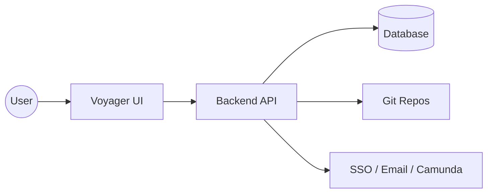
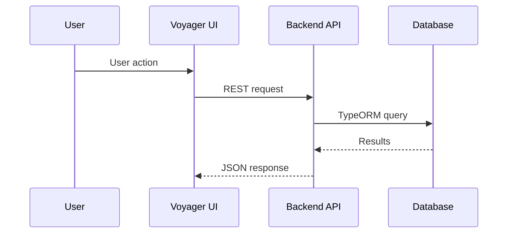

# Architecture Deep Dive

Summary: Technical overview of EnterpriseGlue runtime components and data flow.

Audience: Developers and architects.

## System Overview
EnterpriseGlue is a Docker-first, modular platform with a React frontend and a
Node.js backend API. The backend integrates with multiple database engines via
TypeORM adapters and supports optional integrations (Camunda, SSO providers).



## Runtime Components
- **Voyager UI** (frontend): React/Vite UI shell and feature modules.
- **Backend API**: Node.js API that exposes Starbase and Mission Control routes.
- **Database**: TypeORM-backed relational database (Postgres default).
- **Git storage**: Server-side git repositories on the backend volume.
- **Optional integrations**: Camunda engine, Microsoft Entra ID, Google OAuth.

## Tech Stack
### Frontend
- **React 19** + **Vite**
- **Carbon Design System** (`@carbon/react`)
- **TanStack Query/Table** for data fetching and tables
- **BPMN/DMN tooling** (bpmn-js, camunda-bpmn-js, dmn-js)

### Backend
- **Node.js** + **Express**
- **TypeORM** for data access and migrations
- **Zod** for config validation
- **Swagger UI** for API docs
- **JWT** for auth

### Infrastructure
- **Docker Compose** for local/runtime orchestration
- **PostgreSQL** (default) with adapters for Oracle/MSSQL/Spanner/MySQL

## Request Flow


## Module Boundaries
- **Starbase**: Projects, files, folders, versions, deployments.
- **Mission Control**: Camunda processes, instances, tasks, decisions, batches.
- **Engines**: Engine connectivity and management.
- **Platform Admin**: Tenants, settings, auth policies, audit logs.
- **Git Integration**: OAuth callbacks and repo connections.

## Deployment Topology (Docker-First)
- `db`: PostgreSQL container (default)
- `backend`: API service
- `frontend`: Vite dev server

```mermaid
flowchart TB
  subgraph Docker Compose
    db[(Postgres)]
    backend[Backend API]
    frontend[Frontend (Vite)]
  end
  frontend --> backend
  backend --> db
```

## Configuration & Feature Flags
- Backend configuration is validated on startup.
- Frontend features are gated via `VITE_FEATURE_*` flags.

## Related Docs
- Platform modules overview: `docs/explanation/platform-modules.md`
- Docker deployment: `docs/how-to/deploy-docker.md`
- Configuration: `docs/reference/configuration.md`
