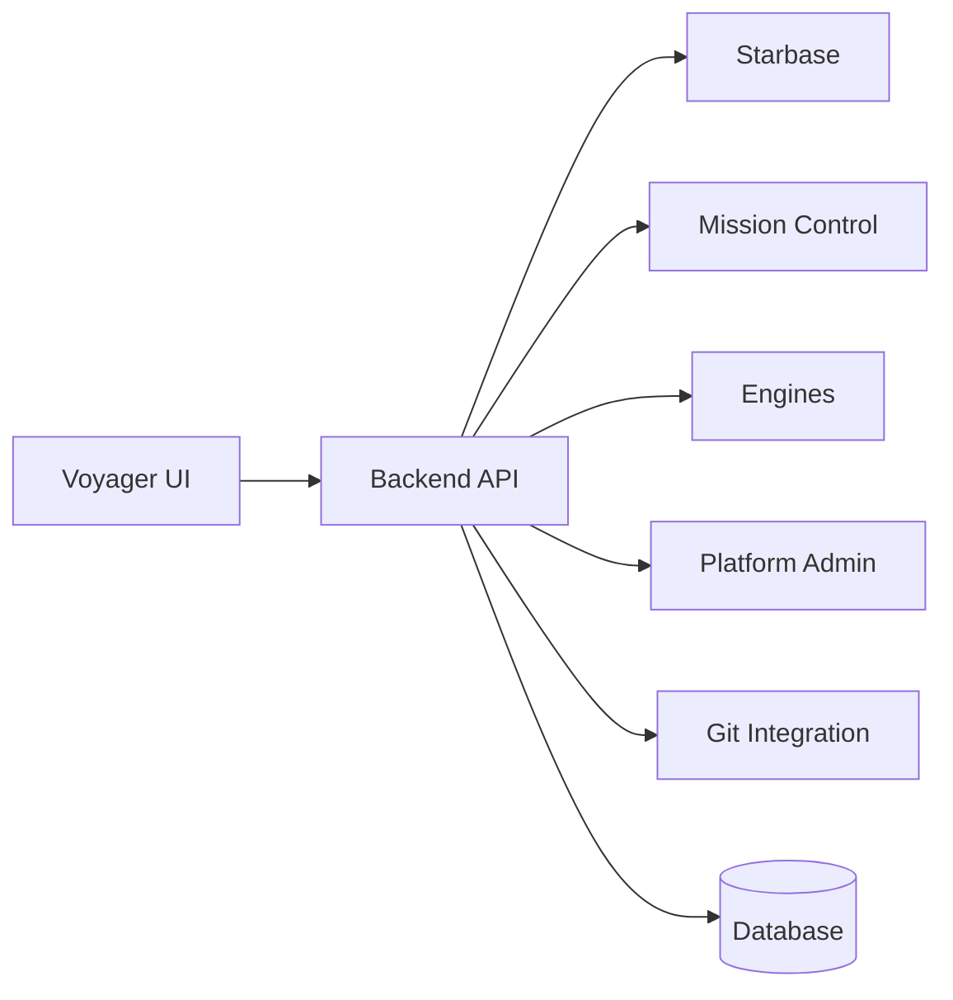

# Platform Modules Overview

Summary: High-level overview of EnterpriseGlue functional modules and how they map
between frontend and backend layers.

Audience: Developers and architects.

## Module Map

## Core Modules
### Voyager (Frontend Shell)
- The primary UI application.
- Feature flags in `frontend/.env.example` control visibility.

### Starbase (Projects & Files)
- Project management, files, folders, versions, deployments.
- Backend entry points: Starbase routes and module exports.

### Mission Control (Camunda Integration)
- Processes, process instances, tasks, decisions, batches, migrations.
- Backend module exports in `backend/src/modules/mission-control`.

### Engines
- Engine management and connectivity (Mission Control UI + backend routes).

### Platform Admin
- Tenant and platform settings, SSO mappings, auth policies, audit logs.

### Git Integration
- OAuth callbacks, repository connections, and server-side git storage.

## Where These Live in the Codebase
- Backend routes: `backend/src/routes/index.ts`
- Mission Control module: `backend/src/modules/mission-control/index.ts`
- Starbase module: `backend/src/modules/starbase/index.ts`
- Frontend routing: `frontend/src/routes/index.tsx`
